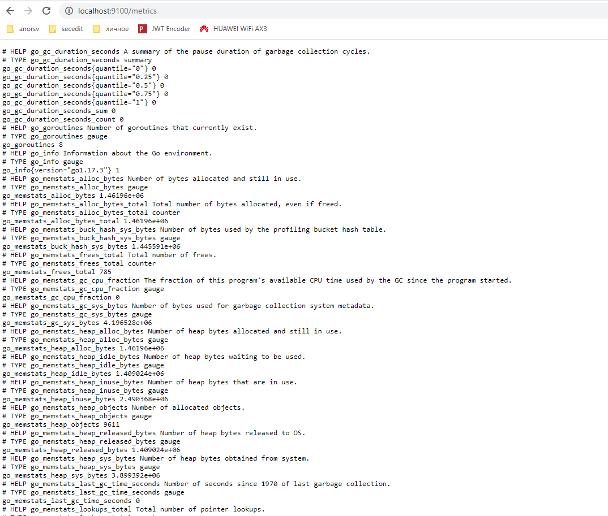
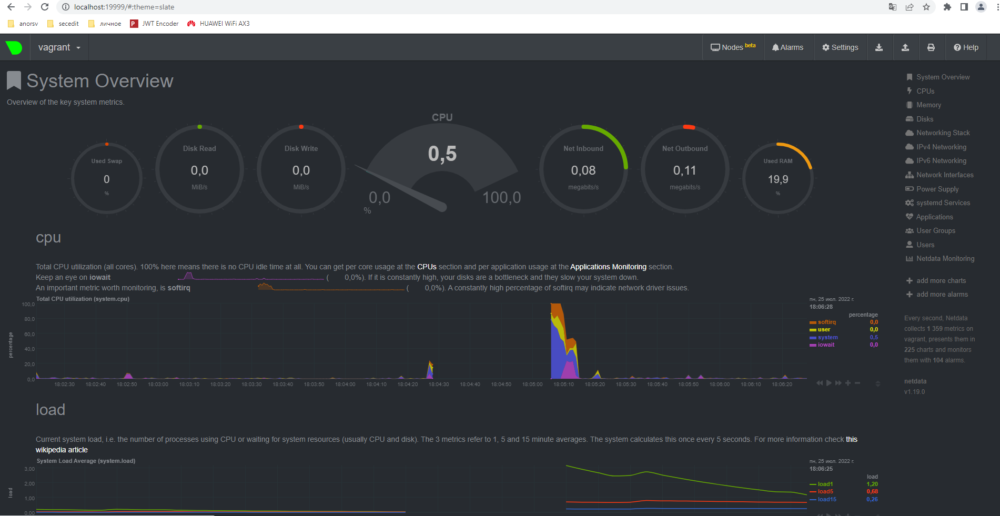

# Домашнее задание к занятию "3.4. Операционные системы, лекция 2"

### 1.  node_exporter
Не сразу все получилось, но работает:

### 2. Приведите несколько опций, которые вы бы выбрали для базового мониторинга хоста по CPU, памяти, диску и сети.

    node_cpu_seconds_total{cpu="0",mode="idle"}
    node_cpu_seconds_total{cpu="0",mode="system"}
    node_cpu_seconds_total{cpu="0",mode="user"}
    
    node_memory_MemAvailable_bytes 
    node_memory_MemFree_bytes
    
    node_disk_read_bytes_total{device="sda"} 
    node_disk_read_time_seconds_total{device="sda"} 
    node_disk_write_time_seconds_total{device="sda"}
    
    node_network_receive_bytes_total{device="eth0"}
    node_network_receive_errs_total{device="eth0"}  
    node_network_transmit_bytes_total{device="eth0"}
    node_network_transmit_errs_total{device="eth0"}

### 3. netdata

Работает!

### 4. Можно ли по выводу dmesg понять, осознает ли ОС, что загружена не на настоящем оборудовании, а на системе виртуализации?

Да, однозначно можно. Поиск по слову "virtual" дает вот такой вывод:

    vagrant@vagrant:~$ dmesg | grep virt
    [    0.003849] CPU MTRRs all blank - virtualized system.
    [    0.031565] Booting paravirtualized kernel on KVM
    [   12.306319] systemd[1]: Detected virtualization oracle.

### 5. Как настроен sysctl fs.nr_open на системе по-умолчанию? Узнайте, что означает этот параметр. Какой другой существующий лимит не позволит достичь такого числа (ulimit --help)?

Максимальное число открытых дескрипторов = 1048576

    vagrant@vagrant:~$ /sbin/sysctl -n fs.nr_open
    1048576

Максимальное значение для ubuntu = 9223372036854775807 

    vagrant@vagrant:~$ cat /proc/sys/fs/file-max
    9223372036854775807

Т.е. первое значение можно увеличить вплоть до этого.

fs.nr_open - максимальное количество, которое можно задать для пользователя.

Для пользователя лимиты: 

    vagrant@vagrant:~$ ulimit -Sn
    1024
    vagrant@vagrant:~$ ulimit -Hn
    1048576

, где -Sn - "мягкий" лимит, -Hn - "жесткий" (абсолютный). При этом ни S, ни H не могут быть более file-max

### 6. ...покажите, что ваш процесс работает под PID 1 через nsenter

Вот это задание не вполне понимаю как делать. Как понять, что он работает под PID 1?

    vagrant@vagrant:~$ ps -e | grep sleep
    1315 tty1     00:00:00 sleep
    vagrant@vagrant:~$ sudo nsenter --target 1315 --pid --mount
    root@vagrant:/# ps
    PID TTY          TIME CMD
    1379 pts/0    00:00:00 sudo
    1380 pts/0    00:00:00 nsenter
    1381 pts/0    00:00:00 bash
    1392 pts/0    00:00:00 ps
    root@vagrant:/#

### 7. Найдите информацию о том, что такое :(){ :|:& };....

Данная конструкция порождает внутри себя два фоновых процесса и двоит их дальше до тех пор, пока не натолкнется на ограничение, заданное для пользователя.

Вывод dmesg, показывающий как работает стабилизация:

    [  313.859198] cgroup: fork rejected by pids controller in /user.slice/user-1000.slice/session-3.scope

